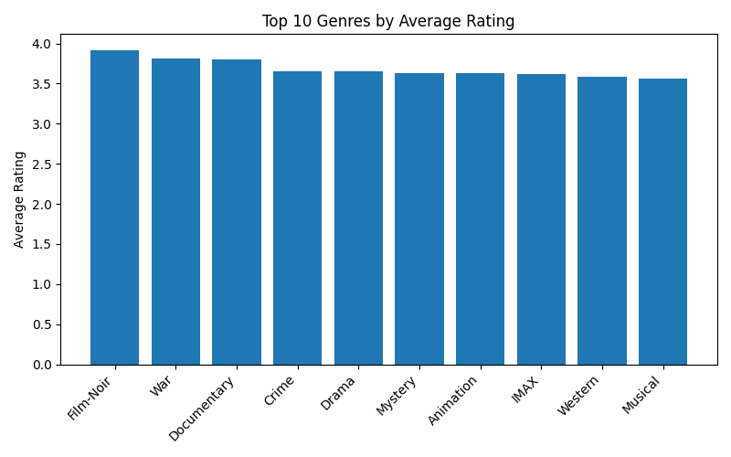

# Namig Amrah’s MovieLens Genre Rating Analysis

**Question:** Which movie genres have the highest average user rating?

**Data:** MovieLens “latest-small” dataset (100 836 ratings, 9 742 movies)

**Tools:** Python, pandas, matplotlib (via Google Colab)

## Steps
1. Downloaded and unzipped the MovieLens `ml-latest-small.zip`.  
2. Loaded `ratings.csv` and `movies.csv` into pandas.  
3. Split each movie’s pipe-separated genres into separate rows.  
4. Merged with ratings and computed the mean rating for each genre.  
5. Plotted the top 10 genres by average rating and saved as `avg_rating_by_genre.png`.

## Result

